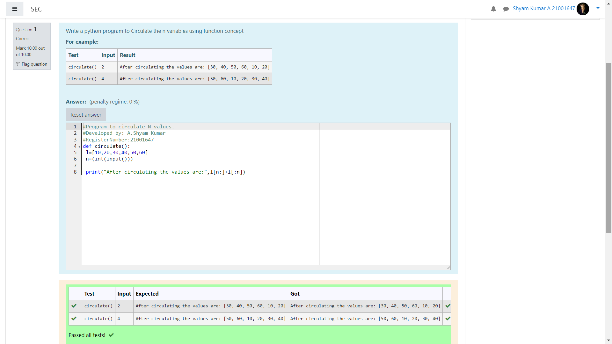

# Circulate-the-values-of-N-variables
## Aim:
To write a python program to circulate the n variables using function concept
## Equipment’s required:
PC
Anaconda - Python 3.7
## Algorithm: 
### Step 1: 
Start the program.
### Step 2: 
Write the function() name. 
### Step 3: 
Get the value from the user for the number of rotation.
### Step 4: 
Using the slicing concept rotate the list
### Step 5:
Print the program to get the answer. 
### Step 6: 
End the program.
## Program:
~~~
def circulate():
 l=[10,20,30,40,50,60]
 n=(int(input()))
 print("After circulating the values are:",l[n:]+l[:n])
~~~

## Output:
]

## Result:
Thus, the cirulation of the values of the N variables are solved using python programming.
